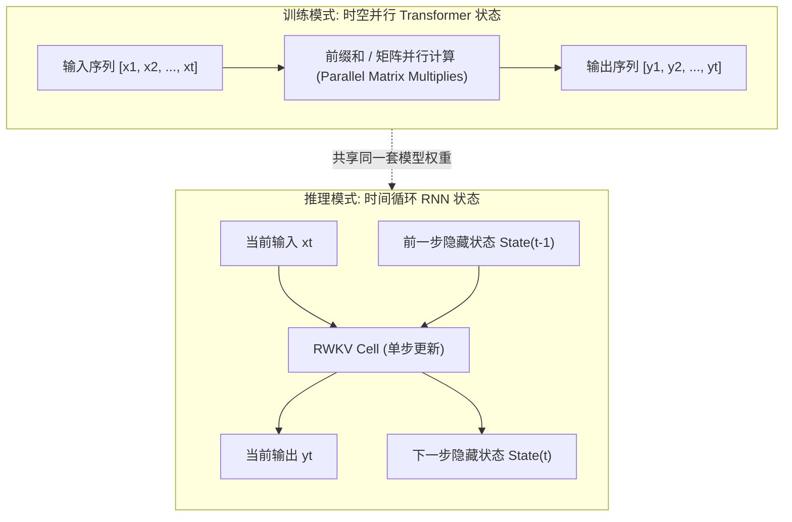
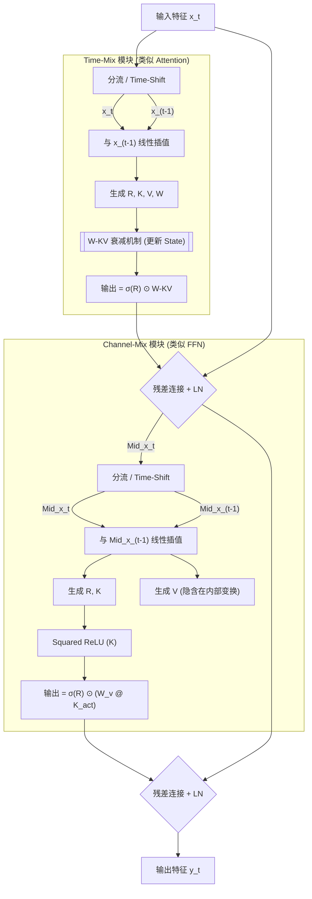
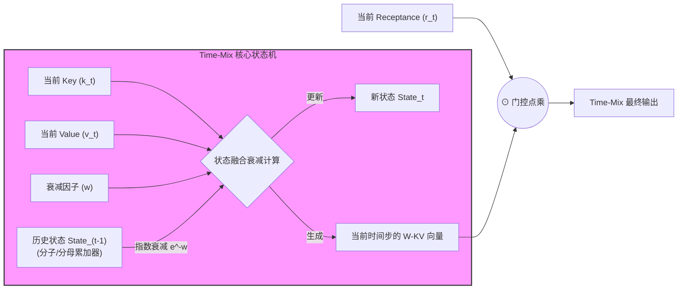

# mermaid graph
## RWKV 训练与推理

```mermaid
graph TD
    %% 训练模式
    subgraph Training_Mode [训练模式: 时空并行 Transformer 状态]
        direction LR
        In_T["输入序列 [x1, x2, ..., xt]"] --> PM["前缀和 / 矩阵并行计算 (Parallel Matrix Multiplies)"]
        PM --> Out_T["输出序列 [y1, y2, ..., yt]"]
    end

    %% 推理模式
    subgraph Inference_Mode [推理模式: 时间循环 RNN 状态]
        direction TB
        In_I["当前输入 xt"] --> Cell["RWKV Cell (单步更新)"]
        State_Pre["前一步隐藏状态 State(t-1)"] --> Cell
        Cell --> Out_I["当前输出 yt"]
        Cell --> State_Next["下一步隐藏状态 State(t)"]
    end

    %% 权重共享关系
    Training_Mode -.->|共享同一套模型权重| Inference_Mode
```
## 单层 RWKV Layer 内部结构

```mermaid
graph TD
    X_in["输入特征 x_t"] --> Fork1["分流 / Time-Shift"]
    
    %% Time-Mix 模块
    subgraph Time_Mix_Block ["Time-Mix 模块 (类似 Attention)"]
        Fork1 -->|"x_t"| TM_Mix["与 x_(t-1) 线性插值"]
        Fork1 -->|"x_(t-1)"| TM_Mix
        TM_Mix --> TM_Linear["生成 R, K, V, W"]
        TM_Linear --> TM_Core[["W-KV 衰减机制 (更新 State)"]]
        TM_Core --> TM_Out["输出 = σ(R) ⊙ W-KV"]
    end

    TM_Out --> Residual1{残差连接 + LN}
    X_in --> Residual1
    
    %% Channel-Mix 模块
    subgraph Channel_Mix_Block ["Channel-Mix 模块 (类似 FFN)"]
        Residual1 -->|"Mid_x_t"| Fork2["分流 / Time-Shift"]
        Fork2 -->|"Mid_x_t"| CM_Mix["与 Mid_x_(t-1) 线性插值"]
        Fork2 -->|"Mid_x_(t-1)"| CM_Mix
        CM_Mix --> CM_Linear["生成 R, K"]
        CM_Mix --> CM_V["生成 V (隐含在内部变换)"]
        CM_Linear --> CM_Act["Squared ReLU (K)"]
        CM_Act --> CM_Out["输出 = σ(R) ⊙ (W_v @ K_act)"]
    end

    CM_Out --> Residual2{残差连接 + LN}
    Residual1 --> Residual2
    Residual2 --> Y_out["输出特征 y_t"]
```
## 核心计算单元 Time-Mix 内部的状态演进

```mermaid
graph LR
    subgraph Key_Value_State_Update [Time-Mix 核心状态机]
        direction LR
        K["当前 Key (k_t)"] --> State_Calc{"状态融合衰减计算"}
        V["当前 Value (v_t)"] --> State_Calc
        W["衰减因子 (w)"] --> State_Calc
        
        State_Pre["历史状态 State_(t-1)<br>(分子/分母累加器)"] -->|指数衰减 e^-w| State_Calc
        State_Calc -->|更新| State_Next["新状态 State_t"]
        State_Calc -->|生成| W_KV["当前时间步的 W-KV 向量"]
    end

    R["当前 Receptance (r_t)"] --> Gate((⊙ 门控点乘))
    W_KV --> Gate
    Gate --> Output["Time-Mix 最终输出"]

    style Key_Value_State_Update fill:#f9f,stroke:#333,stroke-width:2px
```